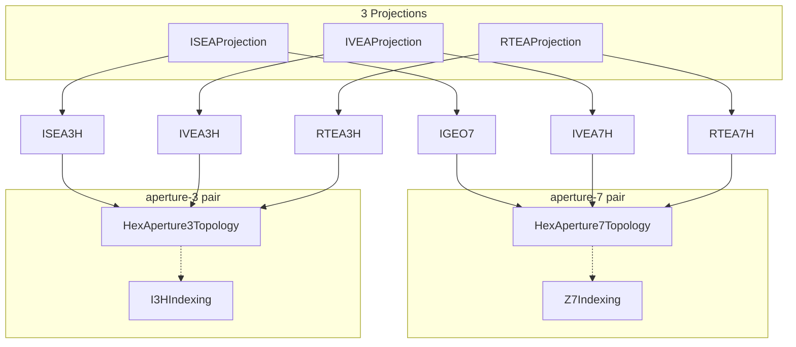
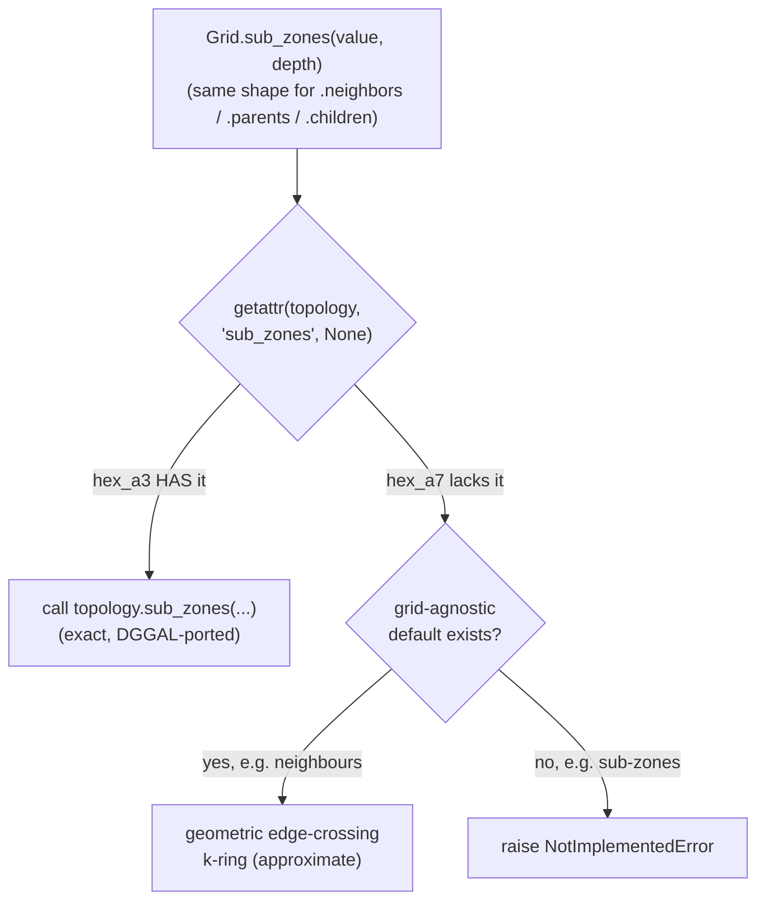

# Architecture — how to study this codebase

This document is for understanding *how the code is put together* and *how to
read it*, as opposed to `README.md` (*what's verified and how to call it*) or
`TUTORIAL.md` (a task-oriented walkthrough with worked examples). Start here
if you want to modify, extend, or just deeply understand `py4dggs`, rather than
only use it.

## The core idea: one Grid = three swappable pieces

A DGGS (Discrete Global Grid System) needs to answer three independent
questions, and this library keeps them as three separate, swappable
components:

1. **Projection** — sphere/ellipsoid (lat/lon) ⟷ a flat 2D "planar" surface.
   *"Where does this point land on the icosahedron's unfolded net?"*
2. **Topology** — the planar surface ⟷ discrete cells (quantize a point to a
   cell; get a cell's own planar centroid/vertices; optionally: neighbours,
   parent/child hierarchy, sub-zones). *"Which hexagon/rhombus is this point
   in, and what shape does that cell have?"*
3. **Indexing** — a cell's internal `(base, digits)` representation ⟷ a
   single packed integer ⟷ a human-readable text id. *"How do I name this
   cell and pack it into one number?"*

```mermaid
flowchart LR
    subgraph Grid["Grid (src/py4dggs/grid.py)"]
        direction TB
        Proj["Projection\nsphere ⟷ planar"]
        Topo["Topology\nplanar ⟷ cell\n(base, digits)"]
        Idx["Indexing\n(base, digits) ⟷\npacked int ⟷ text id"]
    end
    LatLon["(lat, lon)"] -->|forward| Proj
    Proj -->|PlanarPoint| Topo
    Topo -->|quantize| Idx
    Idx -->|encode| Value["packed int\n(Zone.value)"]
    Value -.->|Zone(grid, value)| Zone["Zone\n(immutable wrapper,\nno logic of its own)"]
```

A **`Grid`** (`src/py4dggs/grid.py`) is just these three plus a `GridConfig`
(orientation/authalic settings) glued together:

```python
@dataclass(frozen=True)
class Grid:
    projection: Projection
    topology: Topology
    indexing: Indexing
    config: GridConfig
    name: str
```

**This is the entire reason the library supports 6 grids from so little
code.** `src/py4dggs/registry.py` builds all six as pure *combinations*:

```python
IGEO7  = Grid(ISEAProjection(), HexAperture7Topology(), Z7Indexing(),  GridConfig(), "IGEO7")
IVEA7H = Grid(IVEAProjection(), HexAperture7Topology(), Z7Indexing(),  GridConfig(), "IVEA7H")
RTEA7H = Grid(RTEAProjection(), HexAperture7Topology(), Z7Indexing(),  GridConfig(), "RTEA7H")
ISEA3H = Grid(ISEAProjection(), HexAperture3Topology(), I3HIndexing(), GridConfig(), "ISEA3H")
IVEA3H = Grid(IVEAProjection(), HexAperture3Topology(), I3HIndexing(), GridConfig(), "IVEA3H")
RTEA3H = Grid(RTEAProjection(), HexAperture3Topology(), I3HIndexing(), GridConfig(), "RTEA3H")
```


*3 projections × 2 (topology, indexing) pairs = 6 grids. No grid has its own
geometry code — each is purely a combination of shared pieces.*

Three projections (`isea`/`ivea`/`rtea`) × two topology/indexing pairs
(aperture-7 hex+Z7, aperture-3 rhombic+I3H) = six grids, **zero duplicated
per-grid logic**. Adding `IVEA7H` after `IGEO7` existed changed exactly one
file (a new thin projection class) plus one registry line — the topology and
indexing were reused unchanged. This is the pattern to follow if you ever
add a seventh grid: figure out which of the three pieces is actually new,
and write only that piece.

A **`Zone`** (`src/py4dggs/zone.py`) is an immutable `(grid, value)` pair — it
carries no state of its own; every property/method (`.centroid`,
`.neighbors`, `.parents`, `.sub_zones(depth)`, ...) just calls the
corresponding `Grid` method with `self._value`. If you're reading `zone.py`
and wondering where the actual logic is, it isn't there — follow the call
into `grid.py`.

## The three Protocols (`src/py4dggs/interfaces.py`)

These are `typing.Protocol`s, not base classes — a `Topology`/`Projection`/
`Indexing` implementation doesn't inherit from anything, it just has to have
the right methods. Read `interfaces.py` first; its docstrings are the
authoritative contract every concrete class must satisfy, including which
methods are *optional* (a `Topology` may or may not provide exact
neighbours/hierarchy/sub-zones — see the "OPTIONAL" comment blocks) and what
`Grid` does when a method is absent (falls back to a grid-agnostic default,
or raises `NotImplementedError` if there is no sensible default).


*The one dispatch idiom repeated for `neighbors`/`parents`/`children`/
`centroid_parent`/`is_centroid_child`/`count_sub_zones`/`first_sub_zone`/
`sub_zones` in `grid.py` — this single pattern is how optional per-topology
capabilities get added without ever touching the topology that doesn't have
them.*

- **`Projection`**: `build_geometry(config) -> geom` (precompute once per
  `Grid`, e.g. icosahedron vertex coordinates), `forward(geom, lat, lon) ->
  PlanarPoint`, `inverse(geom, p) -> GeoPoint`. Implementations:
  `projections/isea.py`, `ivea.py`, `rtea.py` — all three are thin wrappers
  around a shared kernel, `projections/icovertex.py`, parameterized by which
  icosahedron vertex is the "radial" one (mirrors DGGAL's
  `VGCRadialVertex {isea, ivea, rtea}` enum). If you're trying to understand
  the actual sphere↔plane math, `icovertex.py` is where it lives; the three
  thin files are just constant tables + which one calls into the shared
  kernel.
- **`Topology`**: `quantize(geom, p, res) -> (base, digits)`,
  `planar_centroid(geom, base, digits) -> PlanarPoint`,
  `planar_vertices(geom, base, digits) -> list[PlanarPoint]`, plus the
  optional neighbours/hierarchy/sub-zones methods. Implementations:
  `topologies/hex_a7.py` (aperture-7 hexagons, digit-addressed — this is
  what Z7/IGEO7 uses) and `topologies/hex_a3.py` (aperture-3, rhombic —
  what I3H/ISEA3H uses). **These two files carry almost all the geometric
  complexity in the library** (see "Z7 vs I3H" below for why they look so
  different from each other).
- **`Indexing`**: `encode(base, digits) -> int`, `decode(value) -> (base,
  digits)`, `resolution`, `is_pentagon`, `parent`, `child_digits`,
  `to_text`/`from_text`, etc. Implementations: `indexings/z7.py` (Z7:
  base-cell + variable-length aperture-7 digit path, packed into one int —
  the *same* congruent scheme `igeo7-py`/DGGAL's `Z7Zone` uses) and
  `indexings/i3h.py` (I3H: a fixed 4-field packed int — level, rhombus root,
  linear rhombus index, sub-hex selector — with NO digit path at all; see
  "Z7 vs I3H" below, this is the single biggest conceptual difference
  between the two grid families).

`src/py4dggs/types.py` has the plain value types everything passes around:
`GeoPoint(lat, lon)`, `PlanarPoint(face, x, y)`, `GridConfig` (the
orientation/authalic knobs), `InvalidZoneError`.

## Z7 vs I3H: the two fundamentally different addressing schemes

This is the single most important thing to understand before reading either
topology file, because it explains why `hex_a7.py` and `hex_a3.py` look so
different from each other despite both being "hexagonal-ish grids."

**Z7 (aperture-7, `hex_a7.py` + `indexings/z7.py`)** is *congruent*: each
cell has exactly one parent and (generically) 7 children, addressed by
appending/dropping one base-7 digit to a variable-length digit path (plus a
fixed base-cell prefix, 0–11). This is DGGAL's own `RI7H_Z7.ec` scheme, and
it's the *same* scheme `igeo7-py`/`igeo7-rs` (the separate, frozen sibling
projects) use — IGEO7's arithmetic was originally written to be bit-identical
to `igeo7-py`'s, except for vertices/neighbours (see README, an actual bug
found in `igeo7-py`). That historical provenance still describes the code,
but this library no longer depends on `igeo7-py` at test time: verification
now runs entirely against pydggal (see `tests/test_isea7h_fuzz.py`), removing
the sibling-repo test dependency `igeo7-py` used to require.

**I3H (aperture-3, `hex_a3.py` + `indexings/i3h.py`)** is *not* addressed by
a digit path at all — DGGAL never defined a congruent "Z3" scheme. Instead
each cell is one rhombus cell in a fixed-size root-rhombus grid, addressed by
`(level, root_rhombus 0-11, linear_index_within_the_rhombus, sub_hex_selector
0-3)`, all packed into one integer (`pack_i3h`/`unpack_i3h` in `i3h.py`).
Text ids look like `"C2-23-C"` (level-letter, hex rhombus-index, sub-hex
letter) — utterly different from Z7's `"0064156"` digit strings, and
*ancestry is not readable from the text id* the way it is for Z7. I3H's
hierarchy is also *non-congruent*: a cell can have 1 or 3 parents and 6 or 7
children (see `hex_a3.py`'s `_i3h_get_parents`/`_i3h_get_children`), because
of a Goldberg Class-I/Class-II alternation between even and odd levels
(`sub_hex` odd/even). If a function in `hex_a3.py` branches on
`sub_hex > 0` ("odd parent") vs `sub_hex == 0`/`>0` in various places, this
alternation is *why*.

**Practical consequence for reading the code:** almost every non-trivial
function in `hex_a3.py` — neighbours, hierarchy, sub-zones — is a faithful,
line-cited port of the corresponding DGGAL eC function, because there is no
generic/derivable shortcut the way there sometimes is for congruent Z7. This
is also why `hex_a3.py` is much larger than `hex_a7.py`.

## The eC-source correspondence convention

Every non-trivial ported function's docstring cites the exact DGGAL eC
source file and line range it's a port of, e.g.:

```python
def _i3h_get_parents(value):
    """getParents (RI3H.ec:1247-1329): [parent0] if a centroid child, else ...
```

The actual eC source lives outside this repo, in the sibling `ut.IGEO7`
workspace at `repos/dggal-v0.06/src/` (e.g. `dggrs/RI3H.ec`,
`dggrs/I3HSubZones.ec`, `projections/ri5x6.ec`, `dggrs.ec` for the base
`DGGRS` class). **If you want to verify a Python function is faithful, or
understand *why* it's shaped the way it is, go read the cited eC lines** —
the Python is usually a near-literal transliteration (same expressions,
same groupings, same epsilons, same evaluation order — see the "byte-faithful"
note below), not a from-scratch reimplementation, so the eC is often clearer
about intent than the Python (which inherits C's terseness).

**Byte-faithfulness rule** (documented in several module docstrings, worth
internalizing once): where the eC has an explicit `(int)floor(x)` cast, the
Python uses `math.floor(x)`; where the eC has a bare `(int)(x)` truncating
cast, the Python uses `math.trunc(x)` (these differ on negative values).
Epsilons (`1e-11`, `1e-12`) are copied verbatim, not "cleaned up," because
DGGAL's own floating-point tie-breaking depends on their exact values.

## Verification: the "oracle" concept

Because this is a *reimplementation* of an existing engine (DGGAL/eC), the
correctness strategy throughout is: don't trust the Python in isolation,
compare it against DGGAL's own C engine. `tests/_pydggal_oracle.py` wraps
**pydggal** (`dggal` on PyPI, the official Python binding to the DGGAL C
library) — calling the actual C code, not another Python reimplementation.
Tests come in two flavors, both against this same oracle:

- **Live differential fuzz** (`test_*_fuzz.py`) — generate random inputs,
  call both this library and pydggal, assert they agree. Requires `dggal`
  installed (`uv add --dev dggal`); skips cleanly if absent.
- **Golden-table conformance** (`test_*_conformance.py`) — frozen JSON
  fixtures (checked into the sibling `igeo7-spec` repo,
  `verify/tables/<grid>/*.json`), generated once from pydggal and replayed
  forever after, so correctness stays pinned even without a live `dggal`
  install (CI-friendly, doesn't rot if pydggal's own API changes).

If you're studying a specific capability (say, sub-zones), the fastest way
to understand *what it's supposed to do* is often to read its test file
before its implementation — the fuzz/conformance tests state the contract
("this must equal pydggal's `getSubZones`") more plainly than the geometric
port code does.

One recurring gotcha worth knowing up front: some grids/values overflow
pydggal's Python-level int marshalling (a real bug in the `dggal` PyPI
package, not in this library or in DGGAL's C core) — see
`documentation/dggs-py-port-lessons.md` in the sibling `ut.IGEO7` repo,
finding #22, if a test or oracle call raises an unexpected `OverflowError`.

## Module map (quick reference)

```
src/py4dggs/
├── __init__.py           # public exports: Grid, Zone, the 6 registry singletons, get_grid, value types
├── interfaces.py         # the 3 Protocols -- READ THIS FIRST
├── types.py               # GeoPoint, PlanarPoint, GridConfig, InvalidZoneError
├── grid.py                 # Grid dataclass -- the dispatch layer (all Zone methods delegate here)
├── zone.py                 # Zone -- immutable (grid, value) wrapper, no logic of its own
├── registry.py             # the 6 Grid singletons + get_grid(name)
├── projections/
│   ├── icovertex.py         # shared ISEA/IVEA/RTEA sphere<->icosahedron-face kernel
│   ├── isea.py / ivea.py / rtea.py   # thin per-variant Projection implementations
├── topologies/
│   ├── hex_a7.py             # aperture-7 hex topology (Z7-compatible; IGEO7/IVEA7H/RTEA7H)
│   └── hex_a3.py             # aperture-3 rhombic topology (I3H; ISEA3H/IVEA3H/RTEA3H) -- the big one
└── indexings/
    ├── z7.py                 # Z7Indexing -- congruent base-cell + digit-path packing
    └── i3h.py                # I3HIndexing -- non-congruent 4-field rhombic packing
```

## How to extend this library

**Adding a projection variant of an existing topology/indexing pair** (the
IVEA7H/RTEA7H/IVEA3H/RTEA3H precedent): write a new thin `Projection` class
in `projections/`, add one line to `registry.py`. Zero changes to any
topology or indexing file. This is the cheapest kind of extension and the
one most likely to come up.

**Adding a genuinely new topology or indexing** (e.g. a triangular or
diamond grid, or an aperture-4/aperture-9 scheme): this is the real work —
look at how `hex_a3.py`/`i3h.py` were built as the template (a
brainstorm→spec→plan cycle per capability slice, each slice prototyped and
verified 0-mismatch against pydggal *before* being folded into the tested
codebase — see the historical specs/plans in the sibling `ut.IGEO7` repo,
`documentation/superpowers/{specs,plans}/`, for the actual decision records:
what was tried, what didn't work, why a given design was chosen).

**Adding a new optional `Topology` capability** (mirroring how exact
neighbours, geometric hierarchy, and sub-zones were each added to `hex_a3`
as opt-in methods without touching `hex_a7`): add the method(s) to
`interfaces.py`'s `Topology` Protocol docstring (documentation only, since
it's a `Protocol` not an ABC), implement them on the topology class(es) that
support it, and add the `Grid`-level dispatch (`getattr(self.topology, name,
None)`, fall back or raise `NotImplementedError`) following the exact
pattern already used for `neighbors`/`parents`/`sub_zones` in `grid.py`.

## Where to go for more history/context

This repo (`to.py4dggs-py`) is the library itself. The **why** behind design
decisions — false starts, rejected approaches, the exact verification
methodology for each capability, and a running catalog of DGGAL/eC porting
pitfalls — lives in the sibling `ut.IGEO7` workspace repo:

- `documentation/superpowers/specs/*.md` — design specs for each capability
  slice (what problem it solves, architecture chosen, why, non-goals).
- `documentation/superpowers/plans/*.md` — the resulting task-by-task build
  plans (useful if you want to see the exact TDD steps something was built
  with).
- `documentation/dggs-py-port-lessons.md` — a running catalog of DGGAL/eC
  quirks discovered during porting (numbered findings, each with root cause
  and fix/workaround) — read this before assuming odd-looking code is a bug;
  it might be a documented, deliberate faithfulness choice.
